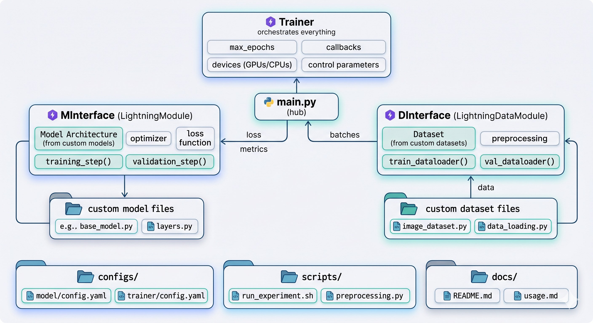

# pl-ml-project-template

[English](README.md) | [中文](README_CN.md)

> A Claude Code skill that scaffolds a PyTorch Lightning project for standard supervised learning research with a single command.

[](https://claude.ai/code)
[](https://python.org)
[](https://lightning.ai)
[](LICENSE)

Reference: [miracleyoo/pytorch-lightning-template](https://github.com/miracleyoo/pytorch-lightning-template)

---

## Comparison with Alternatives

| Feature | This Skill | [cookiecutter-data-science](https://github.com/drivendataorg/cookiecutter-data-science) | [lightning-hydra-template](https://github.com/ashleve/lightning-hydra-template) |
|---------|-----------|------------------------|---------------------------|
| Setup | Single command in Claude Code | cookiecutter CLI + prompts | Hydra + many config files |
| Config system | Simple YAML + argparse | None (manual) | Hydra (powerful but complex) |
| Learning curve | Minimal — 3 files to edit | Low | High (Hydra, callbacks, loggers) |
| Dynamic model loading | Yes — file name = class name | No | Yes (via Hydra) |
| Paper-ready scripts | visualize.py, export_results.py, ablation.sh | No | No |
| AI workflow integration | Built for Claude Code | Generic | Generic |
| Target audience | Researchers wanting quick starts | Data scientists | ML engineers needing full control |

---

## Supported Task Types

| Type | Description |
| ---- | ----------- |
| `classification` | Image or tabular category prediction |
| `regression` | Continuous target prediction |
| `timeseries` | Sequential or sensor forecasting |

**Not intended for:** LLM pretraining, PEFT/LoRA, RAG, agent stacks, inference serving, or pure scikit-learn projects.

---

## Installation

```bash
git clone https://github.com/wangyi0403/pl-ml-project-template ~/.claude/skills/pl-ml-project-template
```

---

## Usage

Tell Claude directly:

```
Initialize a classification experiment project for me
```

Or run the scaffold script manually:

```bash
python scripts/init_project.py /path/to/your/project --task-type classification
python scripts/init_project.py /path/to/your/project --task-type regression
python scripts/init_project.py /path/to/your/project --task-type timeseries

# Force overwrite existing files
python scripts/init_project.py /path/to/your/project --task-type timeseries --force
```

---

## Generated Project Structure

```
project/
├── main.py                     # Entry point: argparse + Trainer assembly
├── utils.py                    # Helpers (config loading, seed, etc.)
├── Makefile                    # One-command workflows
├── README.md
├── requirements.txt
├── .env.example
├── .gitignore
├── configs/
│   └── default.yaml            # Default hyperparameters
├── data/
│   ├── __init__.py
│   ├── data_interface.py       # LightningDataModule interface
│   └── standard_dataset.py     # Placeholder dataset (user replaces)
├── model/
│   ├── __init__.py
│   ├── model_interface.py      # LightningModule interface
│   └── standard_model.py       # Placeholder model (user replaces)
├── scripts/
│   ├── train.sh
│   ├── test.sh
│   ├── run_all.sh              # One-click reproduce: train → test → viz → export
│   ├── ablation.sh             # Ablation study with parameter sweep
│   ├── visualize.py            # Plot training curves → figures/
│   └── export_results.py       # Results JSON → LaTeX table
├── docs/doc/                   # Paper materials (naming: YYYY-MM-DD_description_vN.ext)
├── results/
├── figures/
├── train_log/
└── test_log/
```

---

## Core Design: Interface Pattern

Training logic is decoupled from model and dataset implementations through two interface classes:

```
main.py
  ├── MInterface (LightningModule)     ──dynamic import──>  my_model.py (pure nn.Module)
  └── DInterface (LightningDataModule) ──dynamic import──>  my_data.py  (pure Dataset)
```

**To add a new model:**
1. Create `model/my_model.py` and define `class MyModel(nn.Module)`
2. Run `python main.py --model_name my_model`
3. No changes to interface files or `main.py` needed

Naming convention: file `foo_bar.py` must define class `FooBar`.

---

## Quick Start (after scaffolding)

```bash
make train      # Train
make test       # Evaluate
make visualize  # Plot training curves
make export     # Export results to LaTeX table
make all        # Run full pipeline
make ablation   # Ablation study
```

---

## Architecture



---

## Common Pitfalls

| Problem | Cause | Fix |
|---------|-------|-----|
| `ModuleNotFoundError` | File `my_net.py` but class is `MyNetwork` | Class must be `MyNet` — strict `snake_case` → `CamelCase` |
| Model not found | `--model_name` doesn't match filename | `--model_name foo_bar` → `model/foo_bar.py` → `class FooBar` |
| Config not applied | CLI overrides YAML | YAML only fills `None` args; explicit CLI wins |

---

## License

MIT License — see [LICENSE](LICENSE).
